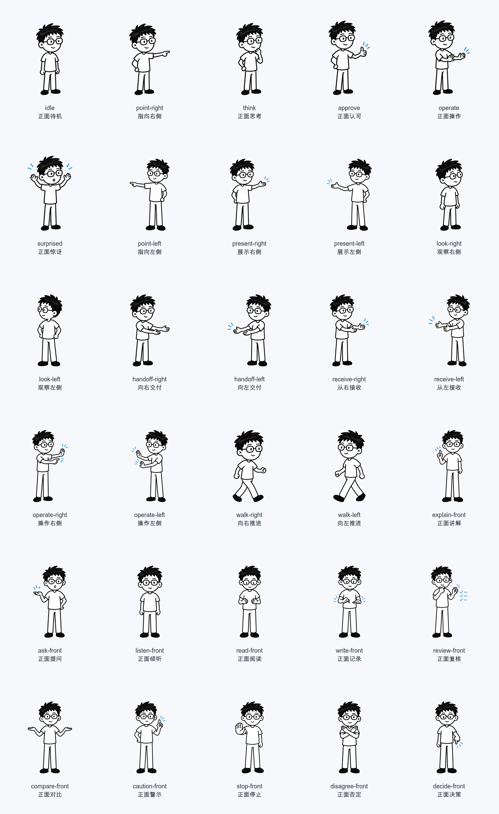
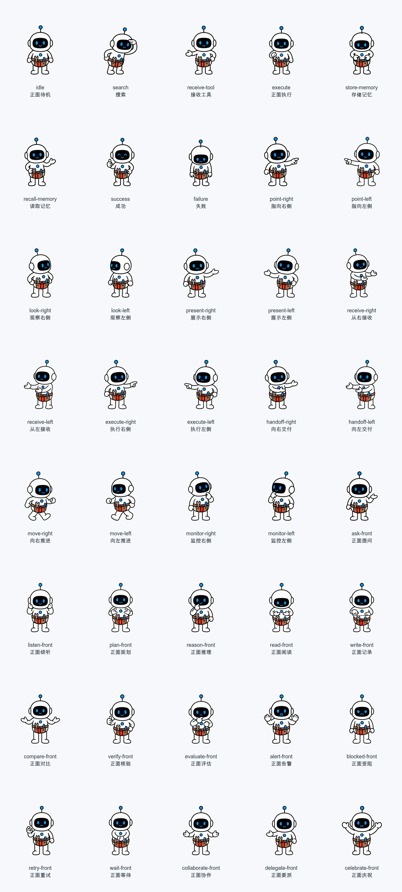
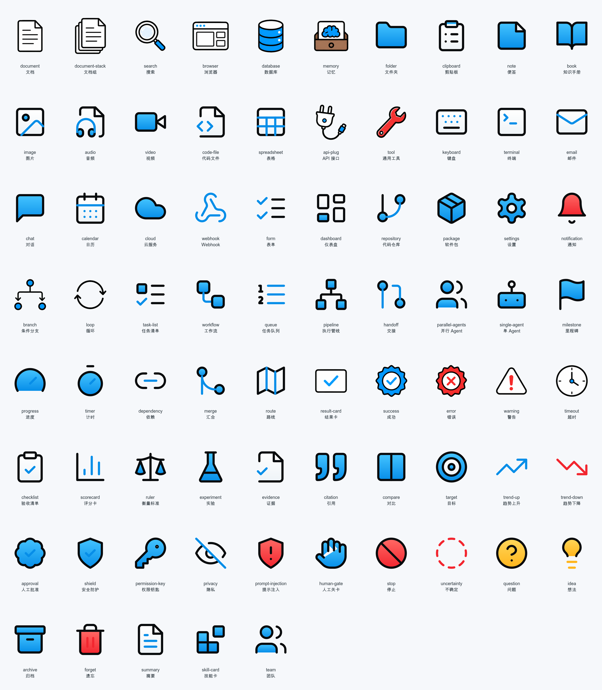

# Tiny Agent v2 素材启用记录

## 审核范围

- 人类：30 个姿势，其中左向 7、右向 7、正面 16。
- Tiny Agent：40 个姿势，其中左向 8、右向 8、正面 24。
- 道具：75 个，分为上下文、工具渠道、流程结构、评估证据、风险决策与复用五组。
- 自动 QA 增加“道具主体不可缺失”检查；用户于 2026-07-17 确认无需继续审核，人工状态记录为 `pass`。

## 预览

## 长期使用重点

1. 左右方向是否符合观看者视角，尤其是 `handoff-*`、`receive-*` 和 `operate-*`。
2. 正面动作中 `listen-front`、`read-front`、`write-front` 是否足够容易区分；这些角色图刻意不绑定具体道具，实际视频中会与文档、表格或对话道具组合。
3. Agent 的 `verify-front` 与既有 `success` 是否需要进一步拉开；`collaborate-front` 与 `delegate-front` 是否需要更强的手势差异。
4. 新增道具已重做为与 v1 一致的填色白板道具：黑色圆角轮廓、白色主体、蓝/黄/红语义填色和轻微明暗层次；禁止回退为统一粗线图标或装饰性占位符。

## 启用状态

本目录固定为 `tiny-agent-v2`，`manifests/asset-pack.json` 的 `activation` 为 `approved`。日更任务从下一次生产开始使用本包；`tiny-agent-v1` 仅在 v2 缺失或准出失败时回退。场景编译必须读取 manifest、按观看者视角选择方向，并在生成 HTML 前校验全部素材 id。
